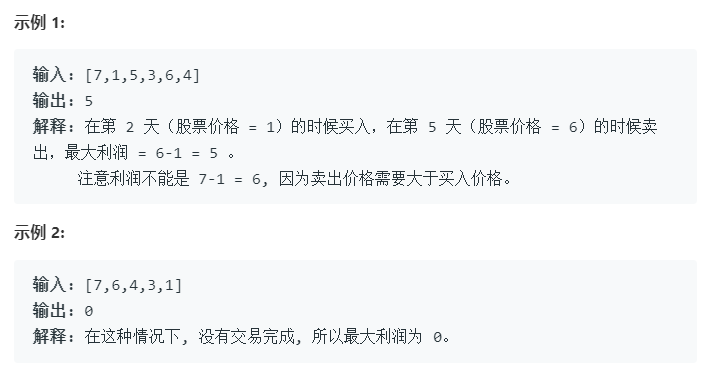

## **买卖股票的最佳时机**

>给定一个数组，它的第 i 个元素是一支给定股票第 i 天的价格。
如果你最多只允许完成一笔交易（即买入和卖出一支股票），设计一个算法来计算你所能获取的最大利润。
注意你不能在买入股票前卖出股票。

**示例**

## 解题

- 暴力解

		public int maxProfit(int[] prices) {
	        if(prices.length<2){
	            return  0;
	        }
	        int max=0;
	        for(int i=0;i<prices.length;i++){
	            for(int j=i+1;j<prices.length;j++){
	                if(prices[j]>=prices[i]){
	                    max=Math.max(prices[j]-prices[i],max);
	                }
	            }
	        }
	    return max;
	    }

- 贪心（一次遍历法）

	
	维护一个最低值。需要遍历价格数组一遍，记录历史最低点，然后在每一天考虑这么一个问题：如果我是在历史最低点买进的，那么我今天卖出能赚多少钱？当考虑完所有天数之时，我们就得到了最好的答案

		public int maxProfit(int[] prices) {
		    if(prices.length<2){
		        return  0;
		    }
			int min=Math.MAX_VALUE;
		    int max=0;
		    for(int i=0;i<prices.length;i++){
		        if(prices[i]<min) min=prices[i];
				else{
					max=Math.max(max,prices[i]-min);
				}
		    }
			return max;
		}
