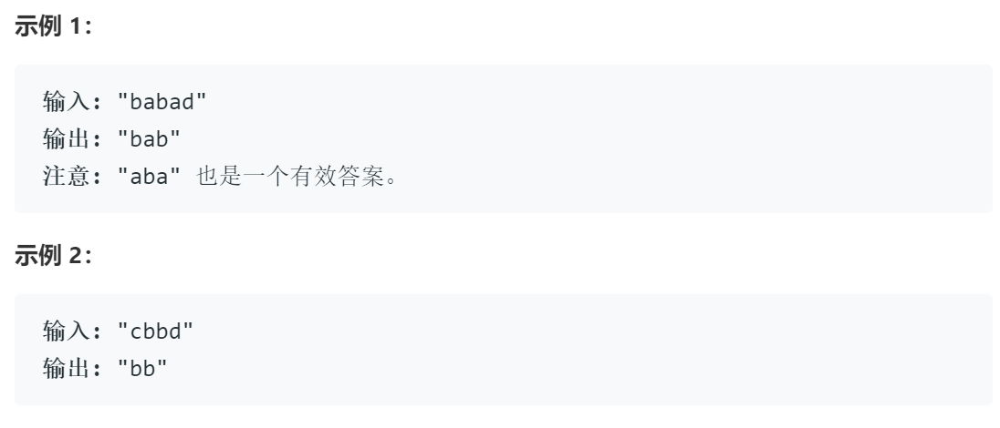
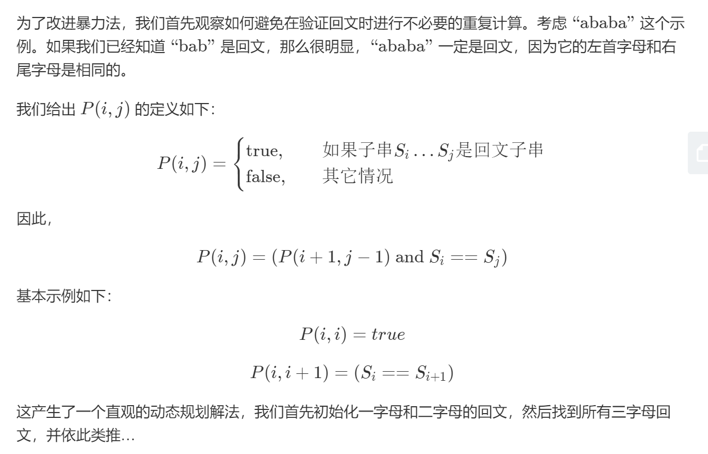

## **最长回文串**##

>给定一个字符串 s，找到 s 中最长的回文子串。你可以假设 s 的最大长度为 1000

**示例**
	

## 解题

- 动态规划
	

	public static String longestPalindrome(String s) {
    if(s.isEmpty())
        return "";
    int length=s.length();
    boolean[][] result=new boolean[length][length];
	//初始化一字符
    for(int i=0;i<length;i++){
        result[i][i]=true;
    }
	//初始化二字符
    for(int i=0;i<length-1;i++){
        result[i][i+1]=s.charAt(i)==s.charAt(i+1);
    }
    int max=1,left=0,right=0;
    for(int i=length-2;i>=0;i--){
        for(int j=i+1;j<length;j++){
            if(j!=i+1) {
                result[i][j] = s.charAt(i) == s.charAt(j) && result[i + 1][j - 1];
            }
            if(j-i+1>max&&result[i][j]) {
                max = j - i + 1;
                left=i;
                right=j;
            }
        }
    }
    return s.substring(left,right+1);
}