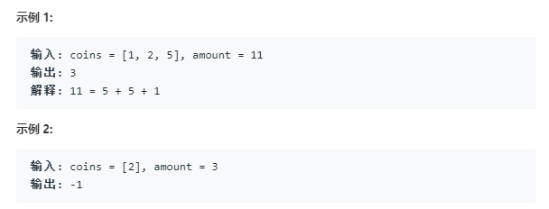

## **零钱兑换**

> 给定不同面额的硬币 coins 和一个总金额 amount。编写一个函数来计算可以凑成总金额所需的最少的硬币个数。如果没有任何一种硬币组合能组成总金额，返回 -1。

**示例**:

## 解题

- 动态规划

	f(n)=f(n-coins[i])的最小值+1 

		public static int coinChange(int[] coins, int amount) {
		        int[] temp=new int[amount+1];
		        temp[0]=0;
		        for(int i=1;i<temp.length;i++){
		            int min=Integer.MAX_VALUE;
		                for(int j=0;j<coins.length;j++){
		                    if(i-coins[j]>=0&&temp[i-coins[j]]!=Integer.MAX_VALUE){
		                        min=Math.min(temp[i-coins[j]]+1,min);
		                    }
		                }
		                temp[i]=min;
		        }
		        return temp[amount]==Integer.MAX_VALUE? -1:temp[amount];
		    }