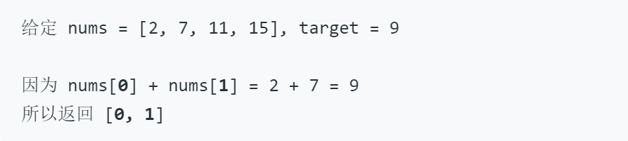

##**两数之和**
>给定一个整数数组 nums 和一个目标值 target，请你在该数组中找出和为目标值的那 两个 整数，并返回他们的数组下标。
你可以假设每种输入只会对应一个答案。但是，你不能重复利用这个数组中同样的元素。

**示例**：

##隐藏提示

- A really brute force（暴力） way would be to search for all possible pairs（一对） of numbers but that would be too slow. Again, it's best to try out brute force solutions for just for completeness（完整性）. It is from these brute force solutions that you can come up with optimizations（优化）.
- The second train of thought is, without changing the array, can we use additional（额外的） space somehow? Like maybe a hash map to speed up the search?

##解题

- 暴力遍历：

		// 双重循环 循环极限为(n^2-n)/2 
		for(int i = 0; i < nums.length; i++){
	         for(int j = nums.length - 1; j > i; j --){
	            if(nums[i]+nums[j] == target){
	                indexs[0] = i;
	                indexs[1] = j; 
	                return indexs;
	             }
	        }
	     }

	可见该方法的时间比较慢
	

- HashMap实现

		class Solution{
		public int[] twoSum(int[] nums,int target){
			hashMap<Integer,Interger> hash=new HashMap<Integer,Interger>();
			for(int i=0;i<nums.length;i++){
				if(hash.containsKey（nums[i])){
					indexs[0]=i;
					indexs[1]=hash.get(nums[i]);
					return indexs;
				}
				hash.put(target-nums[i],i);
			}
		}

	hashMap的速度比普通方法快很多
	

##总结

HashMap确实快,源码之前看过一点忘了，有机会在复习下。