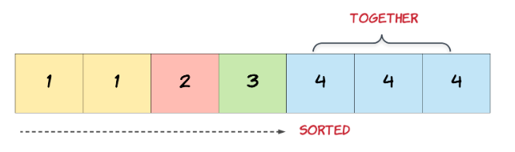
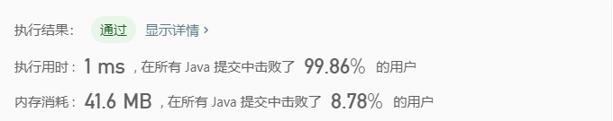

##**删除排序数组中的重复项**

>给定一个排序数组，你需要在 原地 删除重复出现的元素，使得每个元素只出现一次，返回移除后数组的新长度。
不要使用额外的数组空间，你必须在 原地 修改输入数组 并在使用 O(1) 额外空间的条件下完成。

**示例**
	

##隐藏提示

- In this problem, the key point to focus on is the input array being sorted. As far as duplicate（重复的） elements are concerned, what is their positioning in the array when the given array is sorted? Look at the image above for the answer. If we know the position of one of the elements, do we also know the positioning of all the duplicate elements?
	
	

- Essentially(本质上), once an element is encountered（遇到）, you simply need to bypass its duplicates and move on to the next unique element.

##解题

- 双指针遍历
	
	第一个指针直到第二个指针找到与之前不一样的数字以后才往后移动一位，并且将此处的值改为第二个指针对应的值

		class solution{
			public int removeDuplicates(int[] nums){
				if(nums==null||nums.length==0){
					return 0;
				}
				int i=0,j=1;
				while(j<nums.length){
					if(nums[i]==nums[j]){
						j++;
					}
					else{
						i++;
						nums[i]=nums[j];
						j++;
					}							
				}
			}

	

##总结
	2020/3/10，刷了两个数组的题，自己的思维还是很局限，加油吧！

