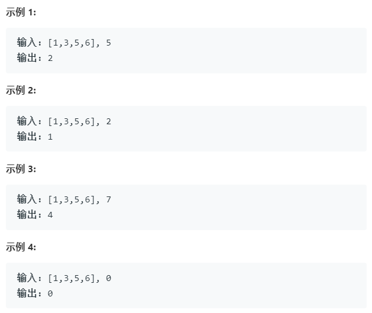

## **搜索插入位置**

>给定一个排序数组和一个目标值，在数组中找到目标值，并返回其索引。如果目标值不存在于数组中，返回它将会被按顺序插入的位置。
你可以假设数组中无重复元素。

**示例**:

	

## 解题

- 普通遍历

    	public int searchInsert(int[] nums, int target) {       
	        for(int j=0;j<nums.length;j++){
	            if(nums[j]==target){
	                return j;
	            }
	            if(nums[j]<target){
	                if(j==nums.length-1){
	                    return j+1;
	                }
	                if(nums[j+1]>target){
	                    return j+1;
	                }	                
	            }
	        }
        	return 0;
   		 }

	但是看了别人的写法，很简洁，用的时间也比我的短。

		public int searchInsert(int[] nums, int target) {       
	        for(int i = 0; i < nums.length;i++){
	            if(nums[i] >= target){
	                return i;
	            }
	         }
	    	return nums.length;
		}

- 二分法：
	
		public int searchInsert(int[] nums, int target) {
	        if(nums.length == 0)return 0;
	        int left = 0,right = nums.length - 1,mid;
	        while(left <= right)
	        {
	            mid = (left + right)/2 ;
	            if(nums[mid] == target) return mid;
	            else if(nums[mid] < target) left = mid+1;
	            else right = mid -1;
	        }
	        return left;
	    }
		

## 总结
	
大学学的二分法，到实际题目里应用的时候又忘了。希望这次过后能好好记住。