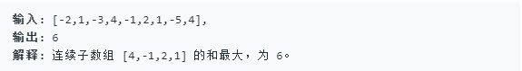

## **最大子序和**

> 给定一个整数数组 nums ，找到一个具有最大和的连续子数组（子数组最少包含一个元素），返回其最大和。

示例：

	
## 解题

- 暴力遍历
	

		public int maxSubArray(int[] nums) {
			if(nums.length==0)
            return 0;
	        int max=nums[0];
	        for(int i=0;i<nums.length;i++){
	            int sum=0;
	            for(int j=i;j<nums.length;j++){
	                sum=sum+nums[j];
	                if(sum>max){
	                    max=sum;
	                }
	            }
	        }
	        return  max;
		 }
		

- 动态规划

		public int maxSubArray(int[] nums) {
		    if(nums.length==0)
		    return 0;
		    int max=nums[0];
			for(int i=1;i<nums.length;i++){
				nums[i]=Math.max(nums[i-i]+nums[i],nums[i]);
			    max=Math.max(max,nums[i]);
			}
			return max;
		}

- 贪心
	
	这个算法，难理解主要在 if (sum < 0) sum = 0;这里。
	我们知道，任何一个最大子序列和，它的第一位都不会是负数。结合贪心算法的定义，当sum小于零时，即使加上后面的数也不会是最大子序列和（不如直接不要当前的sum），所以直接将sum设为0，重新开始计算新的子序列和。

	
		 public int maxSubArray2(int[] nums) {
	        if(nums.length==0)
	            return 0;
	        int max=nums[0],sum=0;
	        for(int i=0;i<nums.length;i++){
	            sum+=nums[i];
	            max=Math.max(max,sum);
	            if(sum<0) sum=0;
	
	        }
	        return  max;
	    }

- 分治法