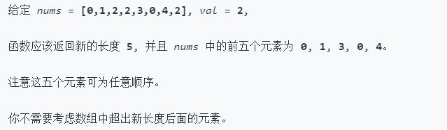

## **移除元素**

>给你一个数组 nums 和一个值 val，你需要 原地 移除所有数值等于 val 的元素，并返回移除后数组的新长度。
不要使用额外的数组空间，你必须仅使用 O(1) 额外空间并 原地 修改输入数组。
元素的顺序可以改变。你不需要考虑数组中超出新长度后面的元素。

实例

## 隐藏提示

- The problem statement clearly asks us to modify the array in-place and it also says that the element beyond the new length of the array can be anything. Given an element, we need to remove all the occurrences of it from the array. We don't technically need to remove that element per-say, right?（问题语句清楚地要求我们在适当的位置修改数组，并且它还指出超出数组新长度的元素可以是任何元素。给定一个元素，我们需要从数组中删除该元素的所有匹配项。从技术上讲，我们不需要每次都删除那个元素，对吧？）

## 解题

- 同样采用双指针
	
		class Solution {
   		public int removeElement(int[] nums, int val) {
	        if (nums == null || nums.length == 0)
				return 0;
			int i=0;
	        for(int j=0;j<nums.length;j++){
	            if(nums[j]!=val){
	                nums[i]=nums[j];
	                i++;
	            }
	        }
	        return i;
	    	}
		}
		
## 总结
简单的一个题目，刚开始却想复杂了。