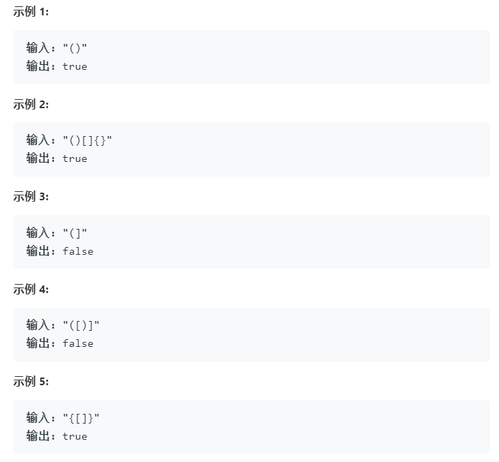
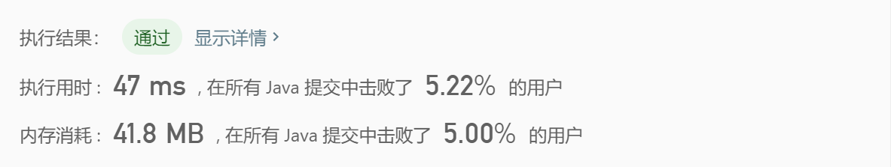
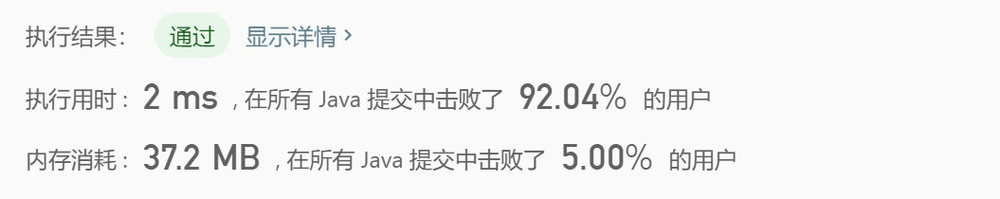

## **有效的括号**

>给定一个只包括 '('，')'，'{'，'}'，'['，']' 的字符串，判断字符串是否有效。
有效字符串需满足：
左括号必须用相同类型的右括号闭合。
左括号必须以正确的顺序闭合。
注意空字符串可被认为是有效字符串。

示例：

## 解题：

- 消除法

	思路很清奇，通过判断有无现成的括号来直接消除掉，但是效率不高，每次循环都会进行一次全局搜索。

		public boolean isValid(String s) {
	        while(s.contains("{}") ||s.contains("[]")||s.contains("()")){
	            s=s.replace("{}","");
	            s=s.replace("[]","");
	            s=s.replace("()","");
	        }
	        return s.isEmpty();
    	}

	

- 栈方法

	最开始写的时候，没有考虑到“}}”这种一来就是右括号的，导致一来就stack.peek()报错，因为刚开始都还没有元素入栈，优化了一下写法如下。

		 public boolean isValid(String s){
	       Stack<Character> stack1=new Stack<Character>();
	        char[] chars = s.toCharArray();
	        for(int i=0;i<chars.length;i++){
	            if(stack1.isEmpty()){
	                stack1.push(chars[i]);
	            }else if(isMatch(stack1.peek(),chars[i])){
	                stack1.pop();
	            } else {
	                stack1.push(chars[i]);
	            }
	        }
	        return  stack1.isEmpty();
	    }
	
	    public boolean isMatch(char c1,char c2){
	        return  c1=='{' &&c2=='}'||c1=='(' &&c2==')'||c1=='[' &&c2==']';
	    }

	