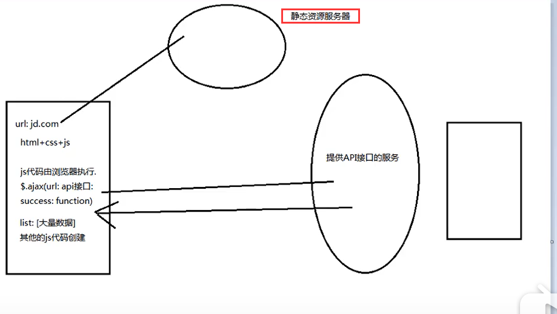

## **VUE ROUTER**
>本文主要以图文的模式描述Vue-router的相关性质以及应用方法的知识。git-commit

Vue Router 是 Vue.js 官方的路由管理器。它和 Vue.js 的核心深度集成，让构建**单页面**应用变得易如反掌。

##前端\后端渲染
常见技术JSP,早期的网页开发整个HTML界面都是由服务器来渲染，返回给客户端进行展示。

- **后端渲染**：常见技术JSP,早期的网页开发整个HTML界面都是由服务器来渲染，返回给客户端进行展示。
- **后端路由**：后端处理URL和页面的映射关系

- **前后端分离**：中期技术，后端只提供数据，首先从静态资源服务器请求html+css+js到浏览器，而后利用ajax技术进行数据请求，最后通过其他JS代码进行渲染

- **spa**: Simple pageweb application(单页富应用)，整个网页只有一个html界面，主要的特点就是在前后端分离的情况下加上了一层前后端路由，也就是前端来维护了一套路由规则。
 

## 不刷新修改URL
- **hash**: 

		location.hash="hello"

- **history**:

		history.pushState({},'','fuck')

- **这两种方式都没有请求新的资源**

## 路由初步使用
- 安装vue-router
- 配置index.js路由文件
- <router-link>标签<router-view>标签的使用

##ROUTER-LIKN补充
- **TAG**: router-link默认渲染为a标签，可以通过tag来修改渲染为其他标签
- **REPLACE**: replace不会留下history记录，所以指定replace的情况下，后退键不能返回到上一个界面中去。
- **ACTIVE-CLASS**：当<router-link>对应的路由匹配成功时，会自动的给当前的元素设置一个router-link-active的class，设置ative-class可以修改默认的名称。

##代码跳转路由
可以在JS文件中实现路由跳转

	<button @click="aboutClick">关于</button>

---
	methods:{
    aboutClick(){
      this.$router.push('/about');   
      this.$router.replace('/about');
    }
	}

##动态路由的使用
- 动态拼接路由url 

- 路由路径配置

- 组件获取参数

##路由的懒加载

当打包构建应用的时候，javaScript包会变得非常大，影响页面的加载。
如果当我们能把不同的路由所对应的组件分割成不同的代码块。然后当路由被访问的时候才对应的加载这些组件，这样就更加的高效了

	component: () => import('./components/xx.vue')

##嵌套路由

- **引入** 
	嵌套路由是一个很常见的功能，比如在Home页面中，我们希望通过/Home/news和/Home/masssage访问的一些内容。
一个路径映射一个组件，访问这个两个路径也会分别渲染两个组件。

- **实现**： 实现嵌套路由有两个步骤
	- 创建对应的子组件，并且在路由映射关系中配置对应的子路由。
	- 在组件内部使用<router-view>标签
	
- **具体代码**

	

##router传递参数

- **paramas方法**

	- 配置路由格式： /router/:id
	- 传递的方式：在path后面跟上对应的值
	- 传递后形成的路径 ： /router/123, /router/abc

- **query方法**
	- 配置路由的格式： /router，也就是普通配置
	- 传递的方式。对象中使用query的key作为传递方式
	- 传递后形成的路径: /router?id=123,/router?id=abc

 

	
